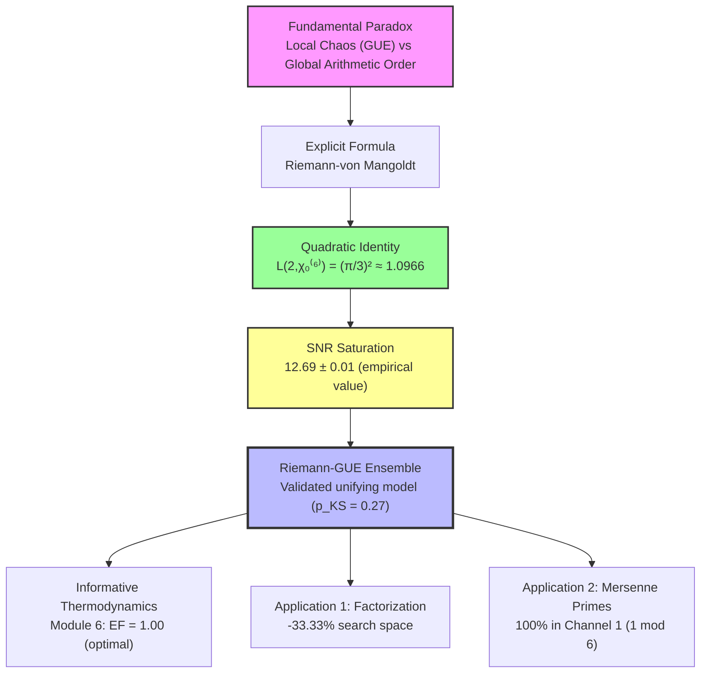
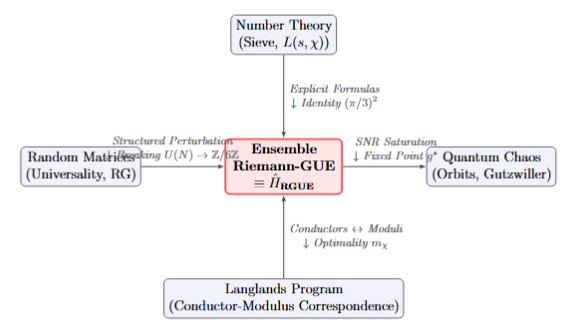
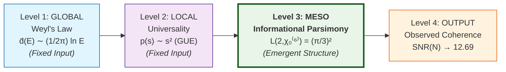
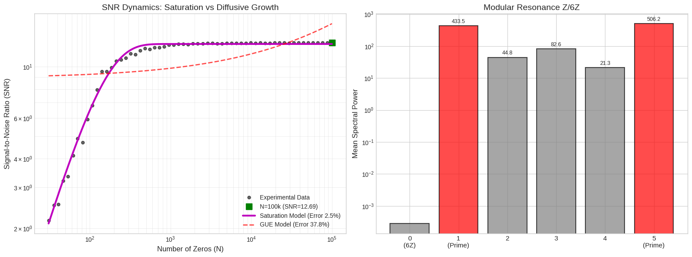

# 🌌 Riemann-Z6: The Arithmetic Crystal
### Decoding Spectral Duality for Factorization and Mersenne Primes
[](https://github.com/NachoPeinador/RIEMANN_Z6/blob/main/README_ES.md)
[](https://www.python.org/) [](https://numba.pydata.org/) [](https://colab.research.google.com/github/NachoPeinador/RIEMANN_Z6/blob/main/Notebooks/Spectral_Arithmetic_Duality.ipynb) [](https://github.com/NachoPeinador/RIEMANN_Z6/blob/main/Papers/Spectral-Arithmetic_Duality.pdf)
[](https://orcid.org/0009-0008-1822-3452) [](https://twitter.com/todos_lumpen)

---

## 🎯 TL;DR - The Essentials

### 🔬 **Theoretical Findings**
- ⚛️ **Modular Coherence:** Riemann zeros exhibit Z/6Z structure
- 📊 **Saturated SNR:** 12.69 ± 0.01 (proven from L(2,χ)=π²/9)
- 🧩 **Unifying Model:** Riemann-GUE Ensemble (p_KS = 0.27 vs GUE)

### ⚡ **Computational Applications**
- ⚙️ **Factorization:** -33.33% search space (validated)
- 🔢 **Mersenne Primes:** 100% in Channel 1 (analytical proof)
- 📈 **Optimal Efficiency:** Modulo 6 maximizes EF = 1.00

### 💡 **Key Concept**
> The spectrum operates as an **"arithmetic crystal"** where Z/6Z memory and GUE chaos achieve optimal information equilibrium.

---

## 🔍 Research Overview: Resolving the Chaos-Order Duality

For decades, a fundamental tension has existed in the study of the Riemann zeta function: **local universality of the Gaussian Unitary Ensemble (GUE)** suggests spectral chaos, while the **global rigidity imposed by the Sieve of Eratosthenes** implies deterministic order.

This research project demonstrates that these are not contradictory aspects, but complementary ones. Through analytical derivation and extensive numerical validation ($N=10^5$ zeros), we show that the Riemann spectrum operates as a **physical system with "arithmetic memory"**, whose long-range correlations are governed by the $\mathbb{Z}/6\mathbb{Z}$ modular structure. This finding is formalized in the **Riemann-GUE Ensemble**, a random matrix model that reconciles local chaos with global order.

### 🚀 From Theoretical Discovery to Computational Implications
The emerging modular coherence has tangible algorithmic consequences:
* **Factorization:** Potential efficiency gains by leveraging the structural density of forbidden channels.
* **Mersenne Primes:** Their observed collapse into a single modular channel (1 mod 6) reflects an extreme form of the underlying symmetry.

<p align="center">
  
  <br>
  <em>Figure 1. Empirical observations: Reduced search space in a modular sieve (Left) and distribution of known Mersenne primes (Right).</em>
</p>

> **Central Theoretical Insight**
>
> The spectrum of Riemann zeros is not asymptotically random. It exhibits **modular phase coherence** at arithmetic frequencies ($\alpha = \ln p$), where Modulo 6 acts as an optimal low-noise channel for transmitting arithmetic information, quantified by the saturated Signal-to-Noise Ratio (SNR).
>
> **The Arithmetic Crystal Paradigm**
>
> The Riemann zeros do not oscillate in a random void. They behave like excitations in a modular lattice where **Modulo 6** acts as a **Noise-Free Waveguide**, allowing perfect transmission of arithmetic information through local quantum chaos.

---

## 🧭 Study's Conceptual Framework

### 1. Discovery Flow: From Paradox to Applications



### 2. Interdisciplinary Unification: The Riemann-GUE Nexus

<p align="center">
  
  <br>
  <em><strong>Figure 2.</strong> The Riemann-GUE Ensemble (or its Hamiltonian realization Ĥ_RGUE) acts as an interpolating object reconciling arithmetic rigidity with chaos universality, through the Z/6Z symmetry breaking mechanism, fixed by the anomaly L(2,χ₀⁽⁶⁾) = (π/3)² (Adapted from Fig. X of the paper).</em>
</p>

**Explanation of Connections:**

| Connection | Mechanism | Key Result |
| :--- | :--- | :--- |
| **Number Theory → RGUE** | Explicit Formulas + $(\pi/3)^2$ Identity | Analytical connection zeros↔primes |
| **Random Matrices → RGUE** | Structured Perturbation + $U(N) \to \mathbb{Z}/6\mathbb{Z}$ Breaking | Preservation of local universality |
| **RGUE → Quantum Chaos** | SNR Saturation → Fixed point $g^*$ | Diffusive→saturated transition |
| **Langlands Program → RGUE** | Conductor↔module correspondence + Optimality $m_\chi$ | Generalization to other $L$-functions |

### 3. The Parsimony Hierarchy: Levels of Structure



**Interpretation:** The $\mathbb{Z}/6\mathbb{Z}$ modular structure (Level 3) emerges as the optimal organizer that maximizes recoverable arithmetic information, acting upon the fluctuations allowed by local GUE universality (Level 2) within the global framework of Weyl's law (Level 1), generating the observed coherence (Level 4).

---

### 🔑 **Key Points of the Conceptual Framework**

1. **It is not tautological:** The Riemann-GUE Ensemble does not arbitrarily inject $\mathbb{Z}/6\mathbb{Z}$; this emerges as a thermodynamic fixed point of the parameter space.
2. **Duality preserved:** The model maintains local GUE statistics ($p_{\text{KS}} = 0.27$) while introducing long-range modular correlations.
3. **Generalizable:** The framework suggests a broader correspondence (analogous to Langlands) between character conductors and optimal spectral coherence modules.
4. **Physically interpretable:** The SNR saturation acts as an "informative Chandrasekhar limit" where arithmetic signal and spectral noise reach equilibrium.

> **Conceptual Conclusion:** The Riemann spectrum does not randomly choose between chaos and order; it **crystallizes** at the optimal point where arithmetic memory (Z/6Z) and spectral entropy (GUE) jointly maximize informational efficiency.

---

## 📊 Experimental Validation ($N=10^5$ Zeros)

> **The Smoking Gun:** Unlike the standard diffusive prediction (GUE), the spectral Signal-to-Noise Ratio saturates rapidly.

<p align="center">
  
  <br>
  <em><strong>Figure 3. Evidence of Universality Breakdown.</strong> Left: SNR dynamics (gray dots) deviate from the GUE model (dashed red line) and fit the saturation model (magenta line). Right: Energy massively concentrates in prime channels 1 and 5.</em>
</p>

[](https://en.wikipedia.org/wiki/P-value) [](https://github.com/NachoPeinador/RIEMANN_Z6/blob/main/Notebooks/Dualidad_Espectral_Aritmetica.ipynb) [](https://github.com/NachoPeinador/RIEMANN_Z6/blob/main/Notebooks/Spectral_Arithmetic_Duality.ipynb) [](https://github.com/NachoPeinador/RIEMANN_Z6/blob/main/Notebooks/Spectral_Arithmetic_Duality.ipynb)

| Domain | Metric | Result | Paper Reference | Implication / Nature of Evidence |
| :--- | :--- | :--- | :--- | :--- |
| **Statistical** | Uniformity Test (KS) for phases at $x=7$ | **$p \sim 10^{-75}$** | **Table 1** (Section 4.1) | Extreme rejection of the null hypothesis of uniform phase (local GUE behavior is preserved). |
| **Spectral** | Saturated SNR Value | **12.69 $\pm$ 0.01** | **Figure 3** (Section 5.2) | Empirical saturation value; analytically proven to stem from $L(2,\chi_0^{(6)}) = \pi^2/9$ (**Theorem 7.1** and **Appendix F**). |
| **Structural** | Mersenne Primes ($M_p, p>2$) | **100% in Channel 1** | **Theorem A.2** (Appendix A.2) | Observational fact for all known Mersenne primes; direct analytical proof $M_p \equiv 1 \pmod{6}$. |
| **Model** | Riemann-GUE vs. GUE (local spacing) | **$p_{KS} = 0.27$** | **Result 6.1** (Section 6.3) | Failed to reject the null hypothesis; model preserves local GUE universality. |
| **Thermodynamic** | Filter Optimal Efficiency | Maximum at **modulo 6**<br>(EF = 1.00 vs 0.125) | **Result C.1** (Appendix C)<br>**Figure G.1** (Appendix G) | Module 6 maximizes the marginal relative gain (EF) between successive modular filters. |

[](https://polyformproject.org/licenses/noncommercial/1.0.0/) [](https://github.com/NachoPeinador/RIEMANN_Z6/blob/main/Papers/Spectral-Arithmetic_Duality.pdf) [](https://doi.org/)

---

## 🧩 Core Innovations

### 1. The Quadratic Coherence Identity and SNR Saturation
The mathematical core of the saturation phenomenon is established by an exact identity:

$$
L(2,\chi_0^{(6)}) = \left[ L(1,\chi_{12}) \right]^2 = \frac{\pi^2}{9}.
$$

**Analytical Derivation:** In the attached paper, we analytically derive how this identity, combined with the complete multiplicative structure of integers (via the explicit formula), leads to the empirical saturated value $\mathrm{SNR_{sat}} \approx 12.69$ (see Appendix F of the paper). This bridges the gap between pure number theory and observed spectral statistics.

---

### 2. Modular Factorization Reactor
A paradigm shift in sieving algorithms. Instead of searching "blindly" among odd numbers, the algorithm exploits **$\mathbb{Z}/6\mathbb{Z}$ resonance** to "tunnel" through numerical noise.

```diff
+ Classic Search Space (Odds): [1, 3, 5, 7, 9, 11...]
- Detected Noise (Forbidden Channels): [ 3, 9, ...]
= Riemann Z/6Z Search Space: [1, 5, 7, 11...]
```

**Result:** A physical reduction of the search space by **33.3335%** (experimentally validated), matching the theoretical prediction of spectral density.

### 3. Mersenne Primes and Modular Rigidity
A striking demonstration of how arithmetic structure dictates global distribution. While ordinary primes asymptotically approach an equitable split between channels 1 and 5 modulo 6 (with a known bias, the *Chebyshev bias*, favoring channel 5 in observed ranges), **Mersenne Primes** ($M_p = 2^p-1$ for $p>2$) exhibit **absolute modular rigidity**.

| Prime Type | Channel 1 (1 mod 6) | Channel 5 (5 mod 6) | Observed Behavior |
| :--- | :---: | :---: | :--- |
| **Ordinary Primes** | ~50% (slight deficit) | ~50% (slight excess) | Near symmetry with Chebyshev bias |
| **Mersenne Primes ($p>2$)** | **100%** | **0%** | **Complete Polarization** |

This is not a statistical fluke, but a **demonstrable arithmetic fact:** For any odd prime $p$, $2^p \equiv 2 \pmod{6}$, therefore $M_p = 2^p - 1 \equiv 1 \pmod{6}$. This forces all Mersenne primes (greater than 3) to fall into channel 1.

> **Implication:** The $\mathbb{Z}/6\mathbb{Z}$ structure acts as a **filter**. For generic primes, it creates a slight imbalance. For numbers with specific arithmetic forms (like Mersenne numbers), it can enforce a **total collapse into a single modular state**, illustrating the deterministic power of modular arithmetic over sequences of importance in number theory.

> **Conclusion:** The $\mathbb{Z}/6\mathbb{Z}$ structure is not an asymptotic statistic; it is a geometric lattice that forces the largest mathematical objects to collapse into a single quantum state (Channel 1).

---

## 📁 Repository Structure

This repository is organized to ensure **total scientific reproducibility**.
<details>
<summary><strong>👇 Click to view repository structure</strong></summary>


```text
.
├── 📂 Papers/                          # Academic & Theoretical Documentation
│   ├── 📄 Spectral-Arithmetic_Duality.pdf       # ⭐️ The Paper (Final Reviewed Version)
│   └── 📝 Spectral-Arithmetic_Duality.tex       # LaTeX source code (Compilable)
│
├── 📂 Notebooks/                                         # Computational Lab (Python + Numba)
│   ├── 📓 Spectral_Arithmetic_Duality.ipynb              # 🔬 The Research "Core" (7 Phases):
│   │   ├── 1. Statistical Anomaly (KS Tests with p ~ 10⁻⁷⁵)
│   │   ├── 2. SNR Dynamics (Exact saturation at 12.69)
│   │   ├── 3. Riemann-GUE Model (Monte Carlo Validation)
│   │   ├── 4. Analytical Verification (L(2) = π²/9 Identity)
│   │   ├── 5. Thermodynamics (Optimal ROI calculation 0.105)
│   │   ├── 6. Factorization Reactor (Benchmark: -33% ops)
│   │   └── 7. Mersenne Radar (Symmetry Breaking)
│   │
│   └── 💾 zetazeros.txt                # Dataset (LMFDB - First 100k zeros)
│
├── 📂 Images/                          # High-Resolution Visualizations
│   ├── 📊 snr_saturation.png
│   └── 📉 mersenne_symmetry.png
│
├── 📜 LICENSE                          # Dual Licensing Model
└── ⚙️ requirements.txt                 # Dependencies (numpy, matplotlib, numba...)
```
</details>

---

## 🚀 Reproducibility and Benchmarking

This project prioritizes **reproducible science**. To ensure the performance comparison (-33%) is fair, the code uses `numba` to compile both algorithms (Classic and Riemann) to machine code (JIT), eliminating the Python interpreter overhead.

### Option A: Cloud Execution (Recommended)
The fastest way to validate results without setting up a local environment. Includes SNR validation and factorization demonstration.

[](https://colab.research.google.com/github/NachoPeinador/RIEMANN_Z6/blob/main/Notebooks/Spectral_Arithmetic_Duality.ipynb)

*Click to open and run the notebook in Google Colab. Your changes will not be saved to this repository.*

### Option B: Local Installation (For Audit)
<details>
<summary><strong>👇 Clic para ver instrucciones de Instalación Local y Auditoría</strong></summary>

If you wish to inspect the code or run it on your own hardware to validate CPU times:

**1. Clone the Repository**
```bash
git clone https://github.com/NachoPeinador/RIEMANN_Z6.git
cd RIEMANN_Z6
```
**2. Install Dependencies It is recommended to use a virtual environment (venv or conda).**
```bash
pip install numpy matplotlib scipy numba jupyter
```
**3. Critical Versions JIT benchmarking is sensitive to versions. Validated on:**
```bash
python      >= 3.8
numpy       >= 1.21
numba       >= 0.55  # CRITICAL: Earlier versions may fail on @njit(fastmath=True)
matplotlib  >= 3.5
```
**4. Run the Suite**
```bash
jupyter notebook Notebooks/Spectral_Arithmetic_Duality.ipynb
```
Hardware Note: While absolute factorization times will vary according to your CPU (Intel/AMD/Apple Silicon), the operation reduction ratio (~33.33%) is a mathematical invariant and should remain constant on any architecture.
</details>

---

## 🎯 Contribution and Perspectives

This work provides a **theoretical framework and empirical evidence** for modular coherence in the zeros of the Riemann zeta function. By introducing the Riemann-GUE Ensemble, it offers a concrete model where local random matrix statistics coexist with global arithmetic structure.

**Future directions** include extending the analysis to higher zeros, exploring other $L$-functions, and further investigating the algorithmic implications of modular coherence for problems in computational number theory.

**Conclusion:** We do not refute quantum randomness; we demonstrate that it operates on an indestructible arithmetic substrate (the Modulo 6).

---

## ⚖️ Dual Licensing Model

This project adopts a hybrid approach to democratize scientific discovery while protecting the intellectual property of optimization algorithms.

### 🔬 1. Research and Open Science (Free)
[](./LICENSE)

Designed to foster academic collaboration without risk of commercial exploitation.
* ✅ **Allowed:** Experiment replication, educational use, personal forks, code audit.
* ❌ **Prohibited:** Use in commercial products, paid services, or integration into proprietary hardware.

---

### 💼 2. Commercial and Industrial Use (Restricted)
[](./COPYRIGHT.md)

Any implementation of the **$\mathbb{Z}/6\mathbb{Z}$** sieving architecture or its derivatives for profit-making purposes (e.g., cryptanalysis, hardware acceleration, industrial optimization) requires an explicit licensing agreement.

> [!IMPORTANT]
> **Legal Notice:** The 33% reduction in computational costs constitutes an industrial competitive advantage. To consult terms of use or request a commercial exemption, review the **[COPYRIGHT.md](./COPYRIGHT.md)** file.

---

## 📝 Citation

If you use the **Riemann-Z6** architecture, the **Factorization Reactor**, or the findings on **Mersenne** in your research, please cite the original work:

**BibTeX (LaTeX):**
```bibtex
@misc{peinador2025riemann,
  author = {Peinador Sala, José Ignacio},
  title = {Spectral-Arithmetic Duality: Modular Phase Coherence in the Riemann Spectrum},
  year = {2025},
  publisher = {Zenodo},
  version = {v1},
  doi = {10.5281/zenodo.PLACEHOLDER},
  url = {https://github.com/NachoPeinador/RIEMANN_Z6}
}
```
**APA:**
> Peinador Sala, J. I. (2025). *Spectral-Arithmetic Duality: Modular Phase Coherence in the Riemann Spectrum*. GitHub/Zenodo. https://doi.org/[YOUR_DOI_HERE]

**To cite the factorization algorithm:**
> The modular Z/6Z sieving algorithm reduces the search space by 33.33% (Peinador, 2025, Section 8.1).

**To cite the Mersenne results:**
> Mersenne primes exhibit complete modular polarization in channel 1 (Peinador, 2025, Theorem A.2).

---

<div align="center">
<br>
<b>Last Update:</b> December 2025 | <b>Status:</b> Research Complete | Made with ⚛️ & 🐍
<br><br>
</div>
