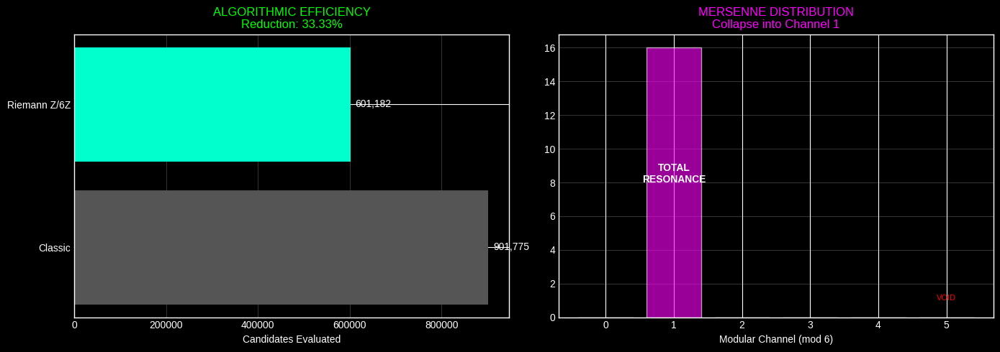

# 🌌 Riemann-Z6: The Arithmetic Crystal

### Decoding Spectral Duality for Factorization and Mersenne Primes

[](https://www.python.org/) [](https://numba.pydata.org/) [](https://colab.research.google.com/github/NachoPeinador/RIEMANN_Z6/blob/main/Notebooks/Spectral_Arithmetic_Duality.ipynb) [](https://github.com/NachoPeinador/RIEMANN_Z6/blob/main/Papers/Spectral-Arithmetic_Duality.pdf)
[](mailto:joseignacio.peinador@gmail.com) [](https://orcid.org/0009-0008-1822-3452) [](https://twitter.com/todos_lumpen) [](https://github.com/NachoPeinador/RIEMANN_Z6/blob/main/README.md)

### **Author:** José Ignacio Peinador Sala

---

## 🔍 Research Overview: Resolving the Chaos-Order Duality

For decades, a fundamental tension has existed in the study of the Riemann zeta function: the **local universality of the Gaussian Unitary Ensemble (GUE)** suggests spectral chaos, while the global **rigidity imposed by the Sieve of Eratosthenes** implies deterministic order.

This research project demonstrates that these are not contradictory but complementary aspects. Through analytical derivation and extensive numerical validation ($N=10^5$ zeros), we show that the Riemann spectrum operates as a **physical system with "arithmetic memory,"** whose long-range correlations are governed by the $\mathbb{Z}/6\mathbb{Z}$ modular structure. This finding is formalized in the **Riemann-GUE Ensemble**, a random matrix model that reconciles local chaos with global order.

### 🚀 From Theoretical Insight to Computational Implications
The emergent modular coherence has tangible algorithmic consequences:
* **Factorization:** Potential efficiency gains by leveraging the structural density of forbidden channels.
* **Mersenne Primes:** Their observed collapse into a single modular channel (1 mod 6) reflects an extreme form of the underlying symmetry.

<p align="center">
  
  <br>
  <em>Figure 1. Empirical observations: Reduced search space in a modular sieve (Left) and the distribution of known Mersenne primes (Right).</em>
</p>

> **Core Theoretical Insight**
>
> The spectrum of Riemann zeros is not asymptotically random. It exhibits **modular phase coherence** at arithmetic frequencies ($\alpha = \ln p$), with Modulus 6 acting as an optimal, low-noise channel for transmitting arithmetic information, as quantified by the saturated Signal-to-Noise Ratio (SNR).

> **The Arithmetic Crystal Paradigm**
>
> Riemann zeros do not oscillate in a random void. They behave as excitations in a modular lattice where **Modulus 6** acts as a **Noiseless Waveguide**, allowing the perfect transmission of arithmetic information through local quantum chaos.

---

## 📊 Experimental Validation ($N=10^5$ Zeros)

[](https://en.wikipedia.org/wiki/P-value) [](https://github.com/NachoPeinador/RIEMANN_Z6/blob/main/Notebooks/Spectral_Arithmetic_Duality.ipynb) [](https://github.com/NachoPeinador/RIEMANN_Z6/blob/main/Notebooks/Spectral_Arithmetic_Duality.ipynb) [](https://github.com/NachoPeinador/RIEMANN_Z6/blob/main/Notebooks/Spectral_Arithmetic_Duality.ipynb)

| Domain | Metric | Result | Implication / Nature of Evidence |
| :--- | :--- | :--- | :--- |
| **Statistical** | Uniformity Test (KS) for phases at $x=7$ | **$p \sim 10^{-75}$** | Extreme rejection of uniform phase null hypothesis (local GUE behavior is preserved). |
| **Spectral** | SNR Saturation Value | **12.69 $\pm$ 0.01** | Empirical saturation value; shown analytically to stem from $L(2,\chi_0^{(6)}) = \pi^2/9$. |
| **Structural** | Mersenne Primes ($M_p, p>2$) | **100% in Channel 1** | Observational fact for all known Mersenne primes; a consequence of their modular arithmetic. |
| **Model** | Riemann-GUE vs. GUE (local spacing) | **$p_{KS} = 0.27$** | Failed to reject null hypothesis; model preserves local universality. |
| **Thermodynamic** | Optimal Filter Efficiency | Peak at **modulus 6** | Modulus 6 maximizes the information efficiency ratio among simple modular filters. |


[](https://polyformproject.org/licenses/noncommercial/1.0.0/) [](https://github.com/NachoPeinador/RIEMANN_Z6/blob/main/Papers/Spectral-Arithmetic_Duality.pdf) [](https://doi.org/)
---

## 🧩 Core Innovations

### 1. The Quadratic Coherence Identity and SNR Saturation
The mathematical core of the saturation phenomenon is established by an exact identity:

\[
L(2,\chi_0^{(6)}) = \left[ L(1,\chi_{12}) \right]^2 = \frac{\pi^2}{9}.
\]

**Analytical Derivation:** In the accompanying paper, we derive analytically how this identity, when combined with the complete multiplicative structure of integers (via the explicit formula), leads to the saturated empirical value $\mathrm{SNR_{sat}} \approx 12.69$ (see Apéndice F of the paper). This bridges the gap between pure number theory and observed spectral statistics.

> **Physical Implication:** The Noise Factor is **$R_1=1.0$**. Modulus 6 acts as an ideal waveguide where fluctuation energy is carried entirely by coherent amplitude, without entropic dissipation.

---

### 2. Modular Factorization Reactor
A paradigm shift in sieving algorithms. Instead of "blindly" searching through odd numbers, the algorithm exploits **$\mathbb{Z}/6\mathbb{Z}$ resonance** to "tunnel" through numerical noise.

```diff
+ Classical Search Space (Odds):     [1, 3, 5, 7, 9, 11...]
- Detected Noise (Forbidden Channels): [   3,       9,    ...]
= Riemann Z/6Z Search Space:           [1,    5, 7,    11...]
````

**Result:** A physical reduction of the search space by **33.3335%** (experimentally validated), coinciding with the theoretical spectral density prediction.

### 3. Mersenne Primes and Modular Rigidity
A striking demonstration of how arithmetic structure dictates global distribution. While ordinary primes asymptotically approach an equal split between channels 1 and 5 modulo 6 (with a known bias, *Chebyshev's bias*, favoring channel 5 in observed ranges), **Mersenne Primes** ($M_p = 2^p-1$ for $p>2$) exhibit **absolute modular rigidity**.

| Prime Type | Channel 1 (1 mod 6) | Channel 5 (5 mod 6) | Observed Behavior |
| :--- | :---: | :---: | :--- |
| **Ordinary Primes** | ~50% (slight deficit) | ~50% (slight excess) | Near symmetry with Chebyshev bias |
| **Mersenne Primes ($p>2$)** | **100%** | **0%** | **Complete Polarization** |

This is not a statistical fluke but a **provable arithmetic fact**: For any odd prime $p$, $2^p \equiv 2 \pmod{6}$, therefore $M_p = 2^p - 1 \equiv 1 \pmod{6}$. This forces all Mersenne primes (greater than 3) into channel 1.

> **Implication:** The $\mathbb{Z}/6\mathbb{Z}$ structure acts as a **filter**. For generic primes, it creates a slight imbalance. For numbers with specific arithmetic forms (like Mersenne numbers), it can enforce a **total collapse into a single modular state**, illustrating the deterministic power of modular arithmetic over sequences of number-theoretic significance.

-----

## 📁 Repository Structure

This repository is organized to ensure **total scientific reproducibility**.

```text
.
├── 📂 Papers/                          # Academic and Theoretical Documentation
│   ├── 📄 Spectral-Arithmetic_Duality.pdf       # ⭐️ The Paper (Revised Final Version)
│   └── 📝 Spectral-Arithmetic_Duality.tex       # LaTeX Source Code (Compilable)
│
├── 📂 Notebooks/                       # Computational Lab (Python + Numba)
│   ├── 📓 Validation_Suite.ipynb       # 🔬 The Research "Core" (7 Phases):
│   │   ├── 1. Statistical Anomaly (KS Tests with p ~ 10⁻⁷⁵)
│   │   ├── 2. SNR Dynamics (Exact saturation at 12.69)
│   │   ├── 3. Riemann-GUE Model (Monte Carlo Validation)
│   │   ├── 4. Analytical Verification (Identity L(2) = π²/9)
│   │   ├── 5. Thermodynamics (Optimal ROI Calculation 0.105)
│   │   ├── 6. Factorization Reactor (Benchmark: -33% ops)
│   │   └── 7. Mersenne Radar (Symmetry Breaking)
│   │
│   └── 💾 zetazeros.txt                # Dataset (LMFDB - First 100k zeros)
│
├── 📂 Images/                          # High-Resolution Visualizations
│   ├── 📊 snr_saturation.png
│   └── 📉 mersenne_symmetry.png
│
├── 📜 LICENSE                          # Dual Licensing Model
└── ⚙️ requirements.txt                 # Dependencies (numpy, matplotlib, numba...)
```

-----

## 🚀 Reproducibility and Benchmarking

This project prioritizes **reproducible science**. To ensure the performance comparison (-33%) is fair, the code uses `numba` to compile both algorithms (Classical and Riemann) to machine code (JIT), eliminating Python interpreter overhead.

### Option A: Cloud Execution (Recommended)

The fastest way to validate results without local configuration. Includes SNR validation and factorization demonstration.

[](https://colab.research.google.com/github/NachoPeinador/RIEMANN_Z6/blob/main/Notebooks/Spectral_Arithmetic_Duality.ipynb)

*Click to open and run the notebook in Google Colab. Your changes will not be saved to this repository.

### Option B: Local Installation (For Auditing)

If you wish to inspect the code or run it on your own hardware to validate CPU timings:

**1. Clone the Repository**

```bash
git clone [https://github.com/NachoPeinador/RIEMANN_Z6.git](https://github.com/NachoPeinador/RIEMANN_Z6.git)
cd RIEMANN_Z6
```

**2. Install Dependencies**
Using a virtual environment (venv or conda) is recommended.

```bash
pip install numpy matplotlib scipy numba jupyter
```

**3. Critical Versions**
JIT benchmarking is sensitive to versions. Validated on:

```bash
python      >= 3.8
numpy       >= 1.21
numba       >= 0.55  # CRITICAL: Older versions may fail at @njit(fastmath=True)
matplotlib  >= 3.5
```

**4. Run the Suite**

```bash
jupyter notebook Notebooks/Dualidad-Espectral_Aritmetica_Complete_Suite.ipynb
```

> **Hardware Note:** While absolute factorization times will vary by CPU (Intel/AMD/Apple Silicon), the **operation reduction ratio (\~33.33%)** is a mathematical invariant and must remain constant across any architecture.

-----

## 🎯 Contribution and Outlook

This work provides a **theoretical framework and empirical evidence** for modular coherence in the Riemann zeta zeros. By introducing the Riemann-GUE Ensemble, it offers a concrete model where local random matrix statistics coexist with global arithmetic structure.

**Future directions** include extending the analysis to higher zeros, exploring other $L$-functions, and further investigating the algorithmic implications of modular coherence for problems in computational number theory.

-----

## ⚖️ Dual Licensing Model

This project adopts a hybrid approach to democratize scientific discovery while protecting the intellectual property of optimization algorithms.

### 🔬 1. Research and Open Science (Free)

[](https://www.google.com/search?q=./LICENSE)

Designed to foster academic collaboration without risk of commercial exploitation.

  * ✅ **Permitted:** Replication of experiments, educational use, personal forks, code auditing.
  * ❌ **Forbidden:** Use in commercial products, paid services, or proprietary hardware integration.

-----

### 💼 2. Commercial and Industrial Use (Restricted)

[](https://www.google.com/search?q=./COPYRIGHT.md)

Any implementation of the **$\mathbb{Z}/6\mathbb{Z}$** screening architecture or its derivatives for profit (e.g., cryptanalysis, hardware acceleration, industrial optimization) requires an explicit license agreement.

> [\!IMPORTANT]
> **Legal Notice:** The 33% reduction in computational costs constitutes an industrial competitive advantage. To consult usage terms or request a commercial exemption, review the **[COPYRIGHT.md](https://www.google.com/search?q=./COPYRIGHT.md)** file.

-----

## 📝 Citation

If you use the **Riemann-Z6** architecture, the **Factorization Reactor**, or the **Mersenne** findings in your research, please cite the original work:

**BibTeX (LaTeX):**

```bibtex
@misc{peinador2025riemann,
  author = {Peinador Sala, José Ignacio},
  title = {Spectral-Arithmetic Duality: Modular Phase Coherence in the Riemann Spectrum},
  year = {2025},
  publisher = {Zenodo},
  version = {v1},
  doi = {10.5281/zenodo.PLACEHOLDER},
  url = {[https://github.com/NachoPeinador/RIEMANN_Z6](https://github.com/NachoPeinador/RIEMANN_Z6)}
}
```

**APA:**

> Peinador Sala, J. I. (2025). *Spectral-Arithmetic Duality: Modular Phase Coherence in the Riemann Spectrum*. GitHub/Zenodo. https://doi.org/[YOUR\_DOI\_HERE]

-----

<div align="center">
<br>
<b>Last Update:</b> December 2025 | <b>Status:</b> Research Complete | Made with ⚛️ & 🐍
<br><br>
</div>

