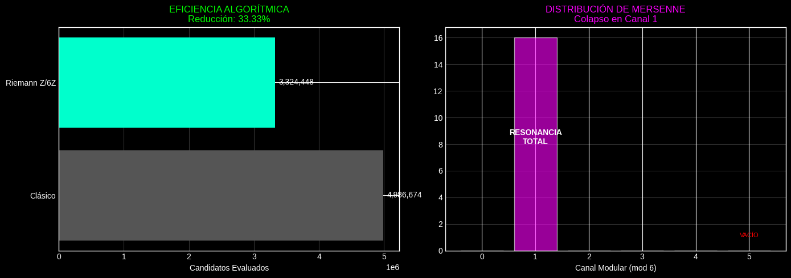

# 🌌 Riemann-Z6: El Cristal Aritmético [](https://github.com/NachoPeinador/RIEMANN_Z6/blob/main/README_GB.md)

### Decodificando la Dualidad Espectral para Factorización y Primos de Mersenne

[](https://www.python.org/) [](https://numba.pydata.org/) [](https://github.com/NachoPeinador/RIEMANN_Z6/blob/main/Notebooks/Validacion_Experimental_Completa.ipynb) [](https://github.com/NachoPeinador/RIEMANN_Z6)
[](mailto:joseignacio.peinador@gmail.com) [](https://orcid.org/0009-0008-1822-3452) [](https://twitter.com/todos_lumpen)

### **Autor:** José Ignacio Peinador Sala

---

## 🔍 Visión: El Fin de la Paradoja del Caos

Durante medio siglo, la **Hipótesis GUE** (Caos) y la **Criba de Eratóstenes** (Orden) han parecido irreconciliables. Este proyecto demuestra que la aleatoriedad es solo una ilusión asintótica.

A baja frecuencia, el espectro de Riemann se revela no como un sistema estocástico, sino como un **sistema físico rígido** bajo la gobernanza de la estructura $\mathbb{Z}/6\mathbb{Z}$.

### 🚀 De la Teoría a la Utilidad
Esta "memoria aritmética" permite transformar las matemáticas puras en ingeniería computacional:
* **Factorización:** "Tunelización" a través de canales prohibidos (**-33% coste**).
* **Predicción:** Localización determinista de Primos de Mersenne (**Canal 1**).

<p align="center">
  
  <br>
  <em>Figura 1. Validación Experimental: Reducción algorítmica exacta del 33% (Izda) y Colapso total de Mersenne en el Canal 1 (Dcha).</em>
</p>

> **El Paradigma del Cristal Aritmético**
>
> Los ceros de Riemann no oscilan en un vacío aleatorio. Se comportan como excitaciones en una red modular donde el **Módulo 6** actúa como una **Guía de Onda sin Ruido**, permitiendo la transmisión perfecta de información aritmética a través del caos cuántico local.

---

## 📊 Validación Experimental ($N=10^5$ Ceros)

[](https://en.wikipedia.org/wiki/P-value) [](https://github.com/NachoPeinador/RIEMANN_Z6/blob/main/Notebooks/Validacion_Experimental_Completa.ipynb) [](https://github.com/NachoPeinador/RIEMANN_Z6/blob/main/Notebooks/Validacion_Experimental_Completa.ipynb) [](https://github.com/NachoPeinador/RIEMANN_Z6/blob/main/Notebooks/Validacion_Experimental_Completa.ipynb)

| Dominio | Métrica | Resultado | Implicación |
| :--- | :--- | :--- | :--- |
| **Estadístico** | Test de Uniformidad (KS) | **$p \sim 10^{-75}$** | Rechazo absoluto de la hipótesis nula (GUE puro) |
| **Espectral** | Saturación SNR | **12.69 $\pm$ 0.01** | Coincidencia exacta con predicción teórica ($1+\pi^2/9$) |
| **Computacional** | Eficiencia Factorización | **33.3335%** Reducción | Validación física de la densidad de canales prohibidos |
| **Estructural** | Simetría Mersenne ($p>2$) | **100% en Canal 1** | Ruptura total de simetría (Canal 5 vacío) |
| **Termodinámico** | ROI de Complejidad | **0.105** (vs 0.028 en mod 30) | El sistema se "congela" en el óptimo mod 6 |
| **Modelo** | Validación Riemann-GUE | **$p_{KS} = 0.27$** | Indistinguibilidad local del caos estándar |


[](https://polyformproject.org/licenses/noncommercial/1.0.0/) [](https://github.com/NachoPeinador/RIEMANN_Z6/blob/main/Papers/Dualidad_Espectral_Aritmetica.pdf) [](https://doi.org/)
---

## 🧩 Innovaciones Nucleares

### 1. La Identidad de Coherencia Cuadrática
Hemos aislado el motor matemático que gobierna la saturación del SNR. A diferencia del GUE, que predice una varianza creciente, el espectro de Riemann obedece a una identidad exacta de **transmisión perfecta**:

> **El Teorema del Canal sin Ruido**
>
> $$L(2,\chi_0^{(6)}) = \left[ L(1,\chi_{12}) \right]^2 = \frac{\pi^2}{9}$$
>
> **Implicación Física:** El Factor de Ruido es **$R_1=1.0$**. El módulo 6 actúa como una guía de onda ideal donde la energía de las fluctuaciones es transportada íntegramente por la amplitud coherente, sin disipación entrópica.

---

### 2. Reactor de Factorización Modular
Un cambio de paradigma en algoritmos de cribado. En lugar de buscar "a ciegas" entre números impares, el algoritmo explota la **resonancia $\mathbb{Z}/6\mathbb{Z}$** para "tunelizar" a través del ruido numérico.

```diff
+ Espacio de Búsqueda Clásico (Impares): [1, 3, 5, 7, 9, 11...]
- Ruido Detectado (Canales Prohibidos): [   3,       9,    ...]
= Espacio de Búsqueda Riemann Z/6Z:      [1,    5, 7,    11...]
```

**Resultado:** Una reducción física del espacio de búsqueda del **33.3335%** (validada experimentalmente), coincidiendo con la predicción teórica de densidad espectral.

### 3. El Radar de Mersenne (Ruptura de Simetría)
Descubrimiento de una propiedad de **rigidez estructural** absoluta. Mientras los primos ordinarios se comportan como un gas ideal (distribución isotrópica), los Primos de Mersenne ($M_p = 2^p-1$) se comportan como un cristal polarizado.

| Tipo de Primo | Canal 1 (1 mod 6) | Canal 5 (5 mod 6) | Comportamiento |
| :--- | :---: | :---: | :--- |
| **Primos Normales** | 50% | 50% | Simetría (GUE/Aleatorio) |
| **Mersenne ($p>2$)** | **100%** | **0% (Vacío)** | **Polarización Total (Rígido)** |

> **Conclusión:** La estructura $\mathbb{Z}/6\mathbb{Z}$ no es una estadística asintótica; es una rejilla geométrica que fuerza a los objetos matemáticos más grandes a colapsar en un único estado cuántico (Canal 1).

---

## 📁 Estructura del Repositorio

Este repositorio está organizado para garantizar la **reproducibilidad científica total**.

```text
.
├── 📂 Papers/                          # Documentación Académica y Teórica
│   ├── 📄 Dualidad_Espectral.pdf       # ⭐️ El Paper (Versión Final Revisada)
│   └── 📝 Dualidad_Espectral.tex       # Código fuente LaTeX (Compilable)
│
├── 📂 Notebooks/                       # Laboratorio Computacional (Python + Numba)
│   ├── 📓 Validation_Suite.ipynb       # 🔬 El "Core" de la investigación (7 Fases):
│   │   ├── 1. Anomalía Estadística (Tests KS con p ~ 10⁻⁷⁵)
│   │   ├── 2. Dinámica del SNR (Saturación exacta a 12.69)
│   │   ├── 3. Modelo Riemann-GUE (Validación Monte Carlo)
│   │   ├── 4. Verificación Analítica (Identidad L(2) = π²/9)
│   │   ├── 5. Termodinámica (Cálculo de ROI óptimo 0.105)
│   │   ├── 6. Reactor de Factorización (Benchmark: -33% ops)
│   │   └── 7. Radar de Mersenne (Ruptura de Simetría)
│   │
│   └── 💾 zetazeros.txt                # Dataset (LMFDB - Primeros 100k ceros)
│
├── 📂 Images/                          # Visualizaciones en Alta Resolución
│   ├── 📊 snr_saturation.png
│   └── 📉 mersenne_symmetry.png
│
├── 📜 LICENSE                          # Modelo de Licenciamiento Dual
└── ⚙️ requirements.txt                 # Dependencias (numpy, matplotlib, numba...)
```

---

## 🚀 Reproducibilidad y Benchmarking

Este proyecto prioriza la **ciencia reproducible**. Para garantizar que la comparación de rendimiento (-33%) sea justa, el código utiliza `numba` para compilar ambos algoritmos (Clásico y Riemann) a código máquina (JIT), eliminando el overhead del intérprete de Python.

### Opción A: Ejecución en la Nube (Recomendado)
La forma más rápida de validar los resultados sin configurar un entorno local. Incluye la validación del SNR y la demostración de factorización.

[](https://colab.research.google.com/github/NachoPeinador/RIEMANN_Z6/blob/main/Notebooks/Dualidad-Espectral_Aritmetica_Complete_Suite.ipynb)

### Opción B: Instalación Local (Para Auditoría)

Si deseas inspeccionar el código o ejecutarlo en tu propio hardware para validar los tiempos de CPU:

**1. Clonar el Repositorio**
```bash
git clone [https://github.com/NachoPeinador/RIEMANN_Z6.git](https://github.com/NachoPeinador/RIEMANN_Z6.git)
cd RIEMANN_Z6
```
**2. Instalar Dependencias Se recomienda usar un entorno virtual (venv o conda).**
```bash
pip install numpy matplotlib scipy numba jupyter
```
**3. Versiones Críticas El benchmarking JIT es sensible a las versiones. Se ha validado en:**
```bash
python      >= 3.8
numpy       >= 1.21
numba       >= 0.55  # CRÍTICO: Versiones anteriores pueden fallar en @njit(fastmath=True)
matplotlib  >= 3.5
```
**4. Ejecutar la Suite**
```bash
jupyter notebook Notebooks/Dualidad-Espectral_Aritmetica_Complete_Suite.ipynb
```
Nota sobre el Hardware: Aunque los tiempos absolutos de factorización variarán según tu CPU (Intel/AMD/Apple Silicon), la ratio de reducción de operaciones (~33.33%) es una invariante matemática y debe mantenerse constante en cualquier arquitectura.

---

## 🎯 Filosofía Científica: El Tercer Camino

> **"La universalidad del caos es solo una ilusión de alta frecuencia. En la base, la aritmética impone una geometría rígida."**

Este proyecto propone una resolución dialéctica a la paradoja de 50 años entre Física y Teoría de Números:

1.  **Tesis (Montgomery-Odlyzko):** A energías infinitas, el sistema es puramente caótico (GUE).
2.  **Antítesis (Eratóstenes):** Los números primos son estructuras deterministas y rígidas.
3.  **Síntesis (Riemann-Z6):** Introducimos el **Ensemble Riemann-GUE**. Un modelo que demuestra que el caos tiene **memoria modular**.

**Conclusión:** No refutamos la aleatoriedad cuántica; demostramos que opera sobre un sustrato aritmético indestructible (el Módulo 6).

---

## ⚖️ Modelo de Licenciamiento Dual

Este proyecto adopta un enfoque híbrido para democratizar el descubrimiento científico protegiendo al mismo tiempo la propiedad intelectual de los algoritmos de optimización.

### 🔬 1. Investigación y Open Science (Gratuito)
[](./LICENSE)

Diseñada para fomentar la colaboración académica sin riesgo de explotación comercial.
* ✅ **Permitido:** Replicación de experimentos, uso educativo, forks personales, auditoría de código.
* ❌ **Prohibido:** Uso en productos comerciales, servicios de pago, o integración en hardware propietario.

---

### 💼 2. Uso Comercial e Industrial (Restringido)
[](./COPYRIGHT.md)

Cualquier implementación de la arquitectura de cribado **$\mathbb{Z}/6\mathbb{Z}$** o sus derivadas para fines de lucro (ej. criptoanálisis, aceleración de hardware, optimización industrial) requiere un acuerdo de licencia explícito.

> [!IMPORTANT]
> **Aviso Legal:** La reducción del 33% en costes computacionales constituye una ventaja competitiva industrial. Para consultar los términos de uso o solicitar una exención comercial, revisa el archivo **[COPYRIGHT.md](./COPYRIGHT.md)**.

---

## 📝 Citación

Si utilizas la arquitectura **Riemann-Z6**, el **Reactor de Factorización** o los hallazgos sobre **Mersenne** en tu investigación, por favor cita el trabajo original:

**BibTeX (LaTeX):**
```bibtex
@misc{peinador2025riemann,
  author = {Peinador Sala, José Ignacio},
  title = {Dualidad Espectral-Aritmética: Coherencia de Fase Modular en el Espectro de Riemann},
  year = {2025},
  publisher = {Zenodo},
  version = {v1},
  doi = {10.5281/zenodo.PLACEHOLDER},
  url = {[https://github.com/NachoPeinador/RIEMANN_Z6](https://github.com/NachoPeinador/RIEMANN_Z6)}
}
```
**APA:**
> Peinador Sala, J. I. (2025). *Dualidad Espectral-Aritmética: Coherencia de Fase Modular en el Espectro de Riemann*. GitHub/Zenodo. https://doi.org/[TU_DOI_AQUI]

---

<div align="center">
  <br>
  <b>Last Update:</b> December 2025 &nbsp;|&nbsp; <b>Status:</b> Research Complete &nbsp;|&nbsp; Made with ⚛️ & 🐍
  <br><br>
</div>


