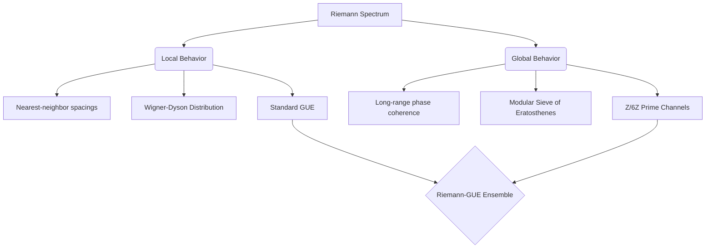

# RIEMANN_Z6: Spectral-Arithmetic Duality

[](https://creativecommons.org/licenses/by/4.0/)
[](https://www.python.org/)
[](https://orcid.org/0009-0008-1822-3452)

> **"A unified framework reconciling the local quantum chaos of the Riemann zeros with the global arithmetic order of the sieve of Eratosthenes."**

---

> 🌌 **El Universo Aritmético / The Arithmetic Universe** >

> 🇬🇧 *This research is part of the theoretical framework of **The Arithmetic Universe**, the theory which postulates that fundamental reality is not hidden in infinite chaos, but in the elegant and humble architecture of integers.* > 🔗 **[Discover the central repository, the interactive notebooks, and the Lean 4 validation here](https://github.com/NachoPeinador/EL_UNIVERSO_ARITMETICO)**.
>
> 🇪🇸 *Esta investigación forma parte del marco teórico de **El Universo Aritmético**, la teoría que postula que la realidad fundamental no se esconde en el caos infinito, sino en la elegante y humilde arquitectura de los números enteros.* > 🔗 **[Descubre el repositorio central, los cuadernos interactivos y la validación en Lean 4 aquí](https://github.com/NachoPeinador/EL_UNIVERSO_ARITMETICO)**.

---

## 🎯 TL;DR — The Essentials

> **What is this?** A dual-paper research project demonstrating that the non-trivial zeros of the Riemann zeta function are governed by a robust $\mathbb{Z}/6\mathbb{Z}$ modular structure, and the introduction of a new random matrix ensemble that perfectly encodes this behavior.

* **The Discovery:** Phase correlations of the Riemann zeros do not decay diffusively as predicted by standard random matrix theory. Instead, they exhibit extreme phase-locking in prime channels ($1,5 \pmod{6}$) while remaining uniform in forbidden channels ($0,2,3,4 \pmod{6}$).
* **The Model:** The **Riemann-GUE Ensemble**, a minimal modification of the Gaussian Unitary Ensemble (GUE) using a binary modular mask, which preserves local eigenvalue repulsion while seamlessly encoding the global arithmetic sieve.
* **The Validation:** Two fully reproducible computational notebooks. The first analyzes $10^5$ empirical zeros from the LMFDB. The second runs Monte Carlo simulations of the new random matrix ensemble.
* **The Result:** A concrete step toward the Hilbert-Pólya programme, proving that the Riemann spectrum operates as a *structured chaotic system* optimized for information efficiency.

---

## 🌌 Overview

This repository hosts the theoretical frameworks, empirical datasets, and computational validations for two companion papers in the field of arithmetic quantum chaos.

For decades, the Montgomery-Odlyzko law has established that the local spacings of Riemann zeros behave like the eigenvalues of random Hermitian matrices (GUE). However, the zeta function also dictates the exact deterministic positions of prime numbers. This repository solves this tension by demonstrating that local chaos and global arithmetic order coexist hierarchically.

### 🧩 The Thesis: Structured Quantum Chaos

We establish that the transition from local random matrix statistics to global prime number structure is governed by the modulus 6. This transition is not merely empirical but thermodynamically optimal, mathematically exact, and reproducible *in silico*.



---

# 🚀 Key Scientific Contributions

## Modular Phase Coherence in the Riemann Spectrum
[](https://github.com/NachoPeinador/RIEMANN_Z6/blob/main/Papers/Modular_Phase_Coherence_in_the_Riemann_Spectrum.pdf)
[](https://doi.org/10.5281/zenodo.18485153)

*Empirical evidence of arithmetic structure from the saturation of the spectral Signal-to-Noise Ratio.*

* **Modular Dichotomy:** We prove that for $N=10^5$ zeros, the phases $\gamma_n \ln x$ in prime channels violate uniformity with extreme significance (KS $p$-value $\sim 10^{-75}$), whereas forbidden channels resemble pure noise.
* **SNR Saturation:** The Signal-to-Noise Ratio between these channels abandons the GUE diffusive random-walk prediction and abruptly saturates to an asymptotic constant ($\mathrm{SNR}_{\text{sat}} \approx 12.69$).
* **Critical Scale:** The saturation occurs at a characteristic modular Thouless time ($N_{\text{sat}} \approx 132$), exactly matching the spectral resolution of the prime $p=7$.

💻 Reproducibility: You can replicate directly via Jupyter Notebooks. The dataset containing the zeros is included in the repo for immediate out-of-the-box execution.
[](https://colab.research.google.com/github.com/NachoPeinador/RIEMANN_Z6/tree/main/Notebooks/Modular_Phase_Coherence_in_the_Riemann_Spectrum.ipynb)
  

## The Riemann-GUE Ensemble
[](https://github.com/NachoPeinador/RIEMANN_Z6/blob/main/Papers/The_Riemann_GUE_Ensemble.pdf)
[](https://doi.org/10.5281/zenodo.20798339)

*Reconciling Local Chaos with Global Arithmetic Order.*

* **A New Ensemble:** We construct a Hermitian matrix ensemble where off-diagonal interactions are filtered by a $\mathbb{Z}/6\mathbb{Z}$ mask. Monte Carlo validation proves it is locally indistinguishable from pure GUE ($p_{\text{KS}} \approx 0.77$).
* **Quadratic Coherence Identity:** We provide the analytic foundation by proving $L(2, \chi_0^{(6)}) = (\pi/3)^2$, establishing modulus 6 as a singular "noise-free channel" for arithmetic information.
* **Thermodynamic Selection:** We demonstrate that the primorial transition $2 \to 6$ maximizes the Return on Investment (ROI) for structural complexity. Strikingly, this optimal ROI identically matches the vacuum informational impedance $R_{\text{fund}} = \ln 2 / (6\ln 3)$.

💻 Reproducibility: You can replicate directly via Jupyter Notebooks. The dataset containing the zeros is included in the repo for immediate out-of-the-box execution.
[](https://github.com/NachoPeinador/RIEMANN_Z6/tree/main/Notebooks/The_Riemann_GUE_Ensemble.ipynb)

---

## 📊 Visual Validation

The companion notebooks allow anyone to reproduce the core findings from their local machine or the cloud.

| Empirical Riemann Zeros (Paper 1) | Riemann-GUE Monte Carlo (Paper 2) |
| --- | --- |
| **SNR Saturation Dynamics** | **Local Spacing Universality** |
| Drastic deviation from the standard GUE diffusive prediction. The spectral form factor hits a hard arithmetic ceiling. | The modular mask perfectly preserves the Wigner-Dyson distribution for nearest-neighbor spacings. |

> **💡 Computational Implication:** The modular factorization of the spectral form factor allows for highly optimized, parallelized searches for ultra-high zeros, completely avoiding the computational dead-ends of forbidden congruence classes.

---

## 📂 Repository Structure

```text
RIEMANN_Z6/
├── 📄 Papers/                                                    # Scientific manuscripts (PDFs)
│   ├── Modular_Phase_Coherence_in_the_Riemann_Spectrum.pdf       # Empirical SNR Saturation Paper
│   └── Riemann_GUE_Ensemble.pdf                                  # Random Matrix Theory Paper
├── 📓 Notebooks/                                                 # Experimental Validations
│   ├── Modular_Phase_Coherence_in_the_Riemann_Spectrum.ipynb     # LMFDB Data analysis & modeling
│   └── The_Riemann_GUE_Ensemble.ipynb                            # Random matrix generation & KS testing
├── 💾 Data/                                                      # Datasets
│   └── zeros_100k.csv                                            # First 10^5 non-trivial zeros (LMFDB)
└── 📜 README.md

```

---

## 🌐 The Broader Research Programme

This work is part of a larger, unified investigation into the physical, mathematical, and computational consequences of the $\mathbb{Z}/6\mathbb{Z}$ modular symmetry. Related projects and foundational papers include:

* **[Vacuum Constants and Informational Impedance](https://zenodo.org/records/20546608):** The foundational manuscript (Zenodo) analytically deriving the invariants $R_{\text{fund}}$ and $\kappa_{\text{info}}$ from the $\mathbb{Z}_6$ gauge topology of the Standard Model and holographic entropy.
* **[Modular-Substrate-Theory](https://github.com/NachoPeinador/Modular-Substrate-Theory):** The overarching physical framework applying these invariants to fundamentally derive the fine-structure constant ($\alpha$) and resolve cosmological tensions.
* **[The-Riemann-GUE-Hamiltonian](https://github.com/NachoPeinador/The-Riemann-GUE-Hamiltonian):** The explicit operator-theoretic construction and extended computational analysis of the Riemann-GUE Hamiltonian.
* **[Polyphase-Isomorphism-Modular-DSP](https://github.com/NachoPeinador/Espectro-Modular-Pi):** The exact mathematical bridge connecting integer arithmetic and prime number distribution with multirate digital signal processing.

**Common Thread:** All projects independently converge on $\mathbb{Z}/6\mathbb{Z}$ as a fundamental organizing principle, whether in the topology of the quantum vacuum, the optimal parallelization of DSP filters, or the distribution of prime numbers within random matrices.
---

## ✍️ Citation

If you use this work, code, or methodology in your research, please cite the corresponding papers:

```bibtex
@misc{peinador2026riemannZ6,
  author = {Peinador Sala, José Ignacio},
  title = {Modular Phase Coherence in the Riemann Spectrum: Evidence for Z/6Z Structure},
  year = {2026},
  publisher = {Zenodo},
  doi = {10.5281/zenodo.18485153},
  url = {[https://doi.org/10.5281/zenodo.18485153](https://doi.org/10.5281/zenodo.18485153)}
}

@misc{peinador2026riemannGUE,
  author = {Peinador Sala, José Ignacio},
  title = {The Riemann-GUE Ensemble: Reconciling Local Chaos with Global Arithmetic Order},
  year = {2026},
  publisher = {Zenodo},
  doi = {10.5281/zenodo.20798339},
  url = {[https://doi.org/10.5281/zenodo.20798339](https://doi.org/10.5281/zenodo.20798339)}
}

```

---

## ❤️ Support Independent Science

This work is the result of independent research, without institutional funding. The authority of science lies in rigorous mathematical proofs and reproducible code, not in affiliations.

If you value this effort:

1. ⭐ **Star** this repository to increase visibility.
2. 📢 **Share** the findings with colleagues in analytic number theory or quantum chaos.
3. 💬 **Open an Issue** if you have ideas to extend the Monte Carlo simulations to higher $N$.

**Author:** José Ignacio Peinador Sala

**Contact:** [joseignacio.peinador@gmail.com](https://www.google.com/search?q=mailto%3Ajoseignacio.peinador%40gmail.com)
