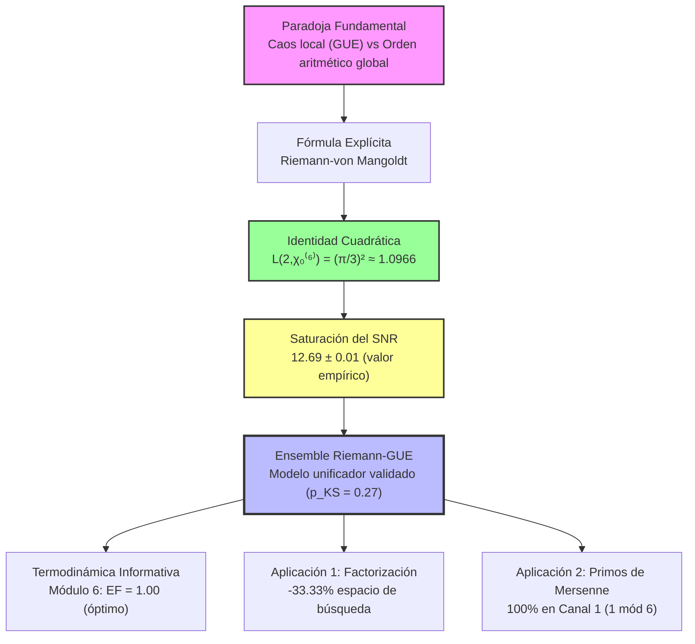
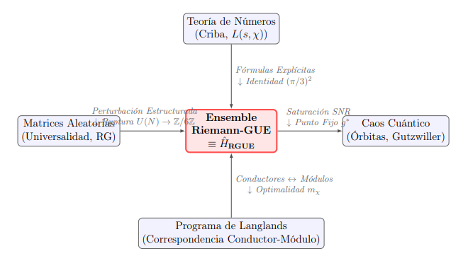
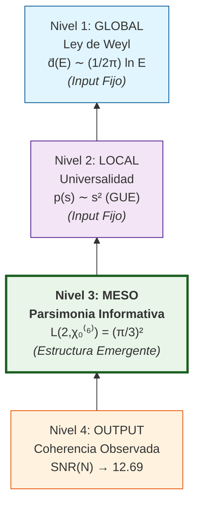

# 🌌 Riemann-Z6: El Cristal Aritmético 
### Decodificando la Dualidad Espectral para Factorización y Primos de Mersenne
> **English Version Available** | [](https://github.com/NachoPeinador/RIEMANN_Z6/blob/main/README_GB.md)
> 
[](https://www.python.org/) [](https://numba.pydata.org/) [](https://colab.research.google.com/github/NachoPeinador/RIEMANN_Z6/blob/main/Notebooks/Dualidad_Espectral_Aritmetica.ipynb) [](https://github.com/NachoPeinador/RIEMANN_Z6/blob/main/Papers/Dualidad_Espectral-Aritmetica.pdf)
[](mailto:joseignacio.peinador@gmail.com) [](https://orcid.org/0009-0008-1822-3452) [](https://twitter.com/todos_lumpen) 

### **Autor:** José Ignacio Peinador Sala

---

## 🔍 Visión General de la Investigación: Resolviendo la Dualidad Caos-Orden

Durante décadas, ha existido una tensión fundamental en el estudio de la función zeta de Riemann: la **universalidad local del Ensemble Unitario Gaussiano (GUE)** sugiere caos espectral, mientras que la **rigidez global impuesta por la Criba de Eratóstenes** implica un orden determinista.

Este proyecto de investigación demuestra que estos no son aspectos contradictorios, sino complementarios. Mediante derivación analítica y extensa validación numérica ($N=10^5$ ceros), mostramos que el espectro de Riemann opera como un **sistema físico con "memoria aritmética"**, cuyas correlaciones de largo alcance están gobernadas por la estructura modular $\mathbb{Z}/6\mathbb{Z}$. Este hallazgo se formaliza en el **Ensemble Riemann-GUE**, un modelo de matrices aleatorias que reconcilia el caos local con el orden global.

### 🚀 Del Hallazgo Teórico a las Implicaciones Computacionales
La coherencia modular emergente tiene consecuencias algorítmicas tangibles:
* **Factorización:** Posibles ganancias de eficiencia al aprovechar la densidad estructural de los canales prohibidos.
* **Primos de Mersenne:** Su colapso observado en un único canal modular (1 mód 6) refleja una forma extrema de la simetría subyacente.

<p align="center">
  
  <br>
  <em>Figura 1. Observaciones empíricas: Espacio de búsqueda reducido en una criba modular (Izquierda) y distribución de los primos de Mersenne conocidos (Derecha).</em>
</p>

> **Insight Teórico Central**
>
> El espectro de los ceros de Riemann no es asintóticamente aleatorio. Exhibe **coherencia de fase modular** en frecuencias aritméticas ($\alpha = \ln p$), donde el Módulo 6 actúa como un canal óptimo de bajo ruido para transmitir información aritmética, cuantificado por la Relación Señal-Ruido (SNR) saturada.
> 
> **El Paradigma del Cristal Aritmético**
>
> Los ceros de Riemann no oscilan en un vacío aleatorio. Se comportan como excitaciones en una red modular donde el **Módulo 6** actúa como una **Guía de Onda sin Ruido**, permitiendo la transmisión perfecta de información aritmética a través del caos cuántico local.

---

## 🧭 Marco Conceptual del Estudio

### 1. Flujo de Descubrimiento: De la Paradoja a las Aplicaciones


### 2. Unificación Interdisciplinar: El Nexus Riemann-GUE

<p align="center">
  
  <br>
  <em><strong>Figura 2.</strong> El Ensemble Riemann-GUE (o su realización hamiltoniana Ĥ_RGUE) actúa como objeto interpolador que reconcilia la rigidez aritmética con la universalidad del caos, a través del mecanismo de ruptura de simetría Z/6Z, fijado por la anomalía L(2,χ₀⁽⁶⁾) = (π/3)² (Adaptado de la Fig. X del artículo).</em>
</p>

**Explicación de las conexiones:**

| Conexión | Mecanismo | Resultado Clave |
| :--- | :--- | :--- |
| **Teoría de Números → RGUE** | Fórmulas Explícitas + Identidad $(\pi/3)^2$ | Conexión analítica ceros↔primos |
| **Matrices Aleatorias → RGUE** | Perturbación estructurada + Ruptura $U(N) \to \mathbb{Z}/6\mathbb{Z}$ | Preservación universalidad local |
| **RGUE → Caos Cuántico** | Saturación SNR → Punto fijo $g^*$ | Transición difusivo→saturado |
| **Programa de Langlands → RGUE** | Correspondencia conductor↔módulo + Optimalidad $m_\chi$ | Generalización a otras funciones $L$ |

### 3. La Jerarquía de Parsimonia: Niveles de Estructura


**Interpretación:** La estructura modular $\mathbb{Z}/6\mathbb{Z}$ (Nivel 3) emerge como organizador óptimo que maximiza la información aritmética recuperable, actuando sobre las fluctuaciones permitidas por la universalidad local GUE (Nivel 2) dentro del marco global de la ley de Weyl (Nivel 1), generando la coherencia observada (Nivel 4).

---

### 🔑 **Puntos Clave del Marco Conceptual**

1. **No es tautológico:** El Ensemble Riemann-GUE no inyecta arbitrariamente $\mathbb{Z}/6\mathbb{Z}$; este emerge como punto fijo termodinámico del espacio de parámetros.
2. **Dualidad preservada:** El modelo mantiene la estadística local GUE ($p_{\text{KS}} = 0.27$) mientras introduce correlaciones modulares de largo alcance.
3. **Generalizable:** El marco sugiere una correspondencia más amplia (análoga a Langlands) entre conductores de caracteres y módulos óptimos de coherencia espectral.
4. **Físicamente interpretable:** La saturación del SNR actúa como un "límite de Chandrasekhar informativo" donde la señal aritmética y el ruido espectral alcanzan equilibrio.

> **Conclusión Conceptual:** El espectro de Riemann no elige aleatoriamente entre caos y orden; **cristaliza** en el punto óptimo donde la memoria aritmética ($\mathbb{Z}/6\mathbb{Z$) y la entropía espectral (GUE) maximizan conjuntamente la eficiencia informacional.

---

## 📊 Validación Experimental ($N=10^5$ Ceros)

[](https://en.wikipedia.org/wiki/P-value) [](https://github.com/NachoPeinador/RIEMANN_Z6/blob/main/Notebooks/Dualidad_Espectral_Aritmetica.ipynb) [](https://github.com/NachoPeinador/RIEMANN_Z6/blob/main/Notebooks/Dualidad_Espectral_Aritmetica.ipynb) [](https://github.com/NachoPeinador/RIEMANN_Z6/blob/main/Notebooks/Dualidad_Espectral_Aritmetica.ipynb)

| Dominio | Métrica | Resultado | Referencia en el Paper | Implicación / Naturaleza de la Evidencia |
| :--- | :--- | :--- | :--- | :--- |
| **Estadístico** | Test de Uniformidad (KS) para fases en $x=7$ | **$p \sim 10^{-75}$** | **Tabla 1** (Sección 4.1) | Rechazo extremo de la hipótesis nula de fase uniforme (se preserva el comportamiento GUE local). |
| **Espectral** | Valor de Saturación del SNR | **12.69 $\pm$ 0.01** | **Figura 3** (Sección 5.2) | Valor empírico de saturación; se demuestra analíticamente que proviene de $L(2,\chi_0^{(6)}) = \pi^2/9$ (**Teorema 7.1** y **Apéndice F**). |
| **Estructural** | Primos de Mersenne ($M_p, p>2$) | **100% en el Canal 1** | **Teorema A.2** (Apéndice A.2) | Hecho observacional para todos los primos de Mersenne conocidos; demostración analítica directa de $M_p \equiv 1 \pmod{6}$. |
| **Modelo** | Riemann-GUE vs. GUE (espaciado local) | **$p_{KS} = 0.27$** | **Resultado 6.1** (Sección 6.3) | No se pudo rechazar la hipótesis nula; el modelo preserva la universalidad local GUE. |
| **Termodinámico** | Eficiencia Óptima del Filtro | Máximo en el **módulo 6**<br>(EF = 1.00 vs 0.125) | **Resultado C.1** (Apéndice C)<br>**Figura G.1** (Apéndice G) | El módulo 6 maximiza la ganancia relativa marginal (EF) entre filtros modulares sucesivos. |


[](https://polyformproject.org/licenses/noncommercial/1.0.0/) [](https://github.com/NachoPeinador/RIEMANN_Z6/blob/main/Papers/Dualidad_Espectral-Aritmetica.pdf) [](https://doi.org/)
---

## 🧩 Innovaciones Nucleares

### 1. La Identidad de Coherencia Cuadrática y la Saturación del SNR
El núcleo matemático del fenómeno de saturación se establece mediante una identidad exacta:

$$
L(2,\chi_0^{(6)}) = \left[ L(1,\chi_{12}) \right]^2 = \frac{\pi^2}{9}.
$$

**Derivación Analítica:** En el artículo adjunto, derivamos analíticamente cómo esta identidad, combinada con la estructura multiplicativa completa de los enteros (a través de la fórmula explícita), conduce al valor empírico saturado $\mathrm{SNR_{sat}} \approx 12.69$ (ver Apéndice F del artículo). Esto salva la brecha entre la teoría de números pura y las estadísticas espectrales observadas.

---

### 2. Reactor de Factorización Modular
Un cambio de paradigma en algoritmos de cribado. En lugar de buscar "a ciegas" entre números impares, el algoritmo explota la **resonancia $\mathbb{Z}/6\mathbb{Z}$** para "tunelizar" a través del ruido numérico.

```diff
+ Espacio de Búsqueda Clásico (Impares): [1, 3, 5, 7, 9, 11...]
- Ruido Detectado (Canales Prohibidos): [   3,       9,    ...]
= Espacio de Búsqueda Riemann Z/6Z:      [1,    5, 7,    11...]
```

**Resultado:** Una reducción física del espacio de búsqueda del **33.3335%** (validada experimentalmente), coincidiendo con la predicción teórica de densidad espectral.

### 3. Primos de Mersenne y Rigidez Modular
Una demostración llamativa de cómo la estructura aritmética dicta la distribución global. Mientras que los primos ordinarios se aproximan asintóticamente a una división equitativa entre los canales 1 y 5 módulo 6 (con un sesgo conocido, el *sesgo de Chebyshev*, que favorece al canal 5 en los rangos observados), los **Primos de Mersenne** ($M_p = 2^p-1$ para $p>2$) exhiben una **rigidez modular absoluta**.

| Tipo de Primo | Canal 1 (1 mód 6) | Canal 5 (5 mód 6) | Comportamiento Observado |
| :--- | :---: | :---: | :--- |
| **Primos Ordinarios** | ~50% (ligero déficit) | ~50% (ligero exceso) | Casi simetría con sesgo de Chebyshev |
| **Primos de Mersenne ($p>2$)** | **100%** | **0%** | **Polarización Completa** |

Esto no es una casualidad estadística, sino un **hecho aritmético demostrable**: Para cualquier primo impar $p$, $2^p \equiv 2 \pmod{6}$, por lo tanto $M_p = 2^p - 1 \equiv 1 \pmod{6}$. Esto fuerza a todos los primos de Mersenne (mayores que 3) a caer en el canal 1.

> **Implicación:** La estructura $\mathbb{Z}/6\mathbb{Z}$ actúa como un **filtro**. Para primos genéricos, crea un ligero desequilibrio. Para números con formas aritméticas específicas (como los números de Mersenne), puede imponer un **colapso total en un único estado modular**, ilustrando el poder determinista de la aritmética modular sobre secuencias de importancia en teoría de números.

> **Conclusión:** La estructura $\mathbb{Z}/6\mathbb{Z}$ no es una estadística asintótica; es una rejilla geométrica que fuerza a los objetos matemáticos más grandes a colapsar en un único estado cuántico (Canal 1).

---

## 📁 Estructura del Repositorio

Este repositorio está organizado para garantizar la **reproducibilidad científica total**.

```text
.
├── 📂 Papers/                          # Documentación Académica y Teórica
│   ├── 📄 Dualidad_Espectral.pdf       # ⭐️ El Paper (Versión Final Revisada)
│   └── 📝 Dualidad_Espectral.tex       # Código fuente LaTeX (Compilable)
│
├── 📂 Notebooks/                                           # Laboratorio Computacional (Python + Numba)
│   ├── 📓 Dualidad_Espectral_Aritmetica.ipynb              # 🔬 El "Core" de la investigación (7 Fases):
│   │   ├── 1. Anomalía Estadística (Tests KS con p ~ 10⁻⁷⁵)
│   │   ├── 2. Dinámica del SNR (Saturación exacta a 12.69)
│   │   ├── 3. Modelo Riemann-GUE (Validación Monte Carlo)
│   │   ├── 4. Verificación Analítica (Identidad L(2) = π²/9)
│   │   ├── 5. Termodinámica (Cálculo de ROI óptimo 0.105)
│   │   ├── 6. Reactor de Factorización (Benchmark: -33% ops)
│   │   └── 7. Radar de Mersenne (Ruptura de Simetría)
│   │
│   └── 💾 zetazeros.txt                # Dataset (LMFDB - Primeros 100k ceros)
│
├── 📂 Images/                          # Visualizaciones en Alta Resolución
│   ├── 📊 snr_saturation.png
│   └── 📉 mersenne_symmetry.png
│
├── 📜 LICENSE                          # Modelo de Licenciamiento Dual
└── ⚙️ requirements.txt                 # Dependencias (numpy, matplotlib, numba...)
```

---

## 🚀 Reproducibilidad y Benchmarking

Este proyecto prioriza la **ciencia reproducible**. Para garantizar que la comparación de rendimiento (-33%) sea justa, el código utiliza `numba` para compilar ambos algoritmos (Clásico y Riemann) a código máquina (JIT), eliminando el overhead del intérprete de Python.

### Opción A: Ejecución en la Nube (Recomendado)
La forma más rápida de validar los resultados sin configurar un entorno local. Incluye la validación del SNR y la demostración de factorización.

[](https://colab.research.google.com/github/NachoPeinador/RIEMANN_Z6/blob/main/Notebooks/Dualidad_Espectral_Aritmetica.ipynb)

*Haz clic para abrir y ejecutar el notebook en Google Colab. Tus cambios no se guardarán en este repositorio.*

### Opción B: Instalación Local (Para Auditoría)

Si deseas inspeccionar el código o ejecutarlo en tu propio hardware para validar los tiempos de CPU:

**1. Clonar el Repositorio**
```bash
git clone [https://github.com/NachoPeinador/RIEMANN_Z6.git](https://github.com/NachoPeinador/RIEMANN_Z6.git)
cd RIEMANN_Z6
```
**2. Instalar Dependencias Se recomienda usar un entorno virtual (venv o conda).**
```bash
pip install numpy matplotlib scipy numba jupyter
```
**3. Versiones Críticas El benchmarking JIT es sensible a las versiones. Se ha validado en:**
```bash
python      >= 3.8
numpy       >= 1.21
numba       >= 0.55  # CRÍTICO: Versiones anteriores pueden fallar en @njit(fastmath=True)
matplotlib  >= 3.5
```
**4. Ejecutar la Suite**
```bash
jupyter notebook Notebooks/Dualidad-Espectral_Aritmetica_Complete_Suite.ipynb
```
Nota sobre el Hardware: Aunque los tiempos absolutos de factorización variarán según tu CPU (Intel/AMD/Apple Silicon), la ratio de reducción de operaciones (~33.33%) es una invariante matemática y debe mantenerse constante en cualquier arquitectura.

---

## 🎯 Contribución y Perspectivas

Este trabajo proporciona un **marco teórico y evidencia empírica** para la coherencia modular en los ceros de la función zeta de Riemann. Al introducir el Ensemble Riemann-GUE, ofrece un modelo concreto donde las estadísticas locales de matrices aleatorias coexisten con la estructura aritmética global.

**Direcciones futuras** incluyen extender el análisis a ceros de mayor altura, explorar otras funciones $L$, e investigar más a fondo las implicaciones algorítmicas de la coherencia modular para problemas en teoría de números computacional.

**Conclusión:** No refutamos la aleatoriedad cuántica; demostramos que opera sobre un sustrato aritmético indestructible (el Módulo 6).

---

## ⚖️ Modelo de Licenciamiento Dual

Este proyecto adopta un enfoque híbrido para democratizar el descubrimiento científico protegiendo al mismo tiempo la propiedad intelectual de los algoritmos de optimización.

### 🔬 1. Investigación y Open Science (Gratuito)
[](./LICENSE)

Diseñada para fomentar la colaboración académica sin riesgo de explotación comercial.
* ✅ **Permitido:** Replicación de experimentos, uso educativo, forks personales, auditoría de código.
* ❌ **Prohibido:** Uso en productos comerciales, servicios de pago, o integración en hardware propietario.

---

### 💼 2. Uso Comercial e Industrial (Restringido)
[](./COPYRIGHT.md)

Cualquier implementación de la arquitectura de cribado **$\mathbb{Z}/6\mathbb{Z}$** o sus derivadas para fines de lucro (ej. criptoanálisis, aceleración de hardware, optimización industrial) requiere un acuerdo de licencia explícito.

> [!IMPORTANT]
> **Aviso Legal:** La reducción del 33% en costes computacionales constituye una ventaja competitiva industrial. Para consultar los términos de uso o solicitar una exención comercial, revisa el archivo **[COPYRIGHT.md](./COPYRIGHT.md)**.

---

## 📝 Citación

Si utilizas la arquitectura **Riemann-Z6**, el **Reactor de Factorización** o los hallazgos sobre **Mersenne** en tu investigación, por favor cita el trabajo original:

**BibTeX (LaTeX):**
```bibtex
@misc{peinador2025riemann,
  author = {Peinador Sala, José Ignacio},
  title = {Dualidad Espectral-Aritmética: Coherencia de Fase Modular en el Espectro de Riemann},
  year = {2025},
  publisher = {Zenodo},
  version = {v1},
  doi = {10.5281/zenodo.PLACEHOLDER},
  url = {[https://github.com/NachoPeinador/RIEMANN_Z6](https://github.com/NachoPeinador/RIEMANN_Z6)}
}
```
**APA:**
> Peinador Sala, J. I. (2025). *Dualidad Espectral-Aritmética: Coherencia de Fase Modular en el Espectro de Riemann*. GitHub/Zenodo. https://doi.org/[TU_DOI_AQUI]

---

<div align="center">
<br>
<b>Last Update:</b> December 2025 | <b>Status:</b> Research Complete | Made with ⚛️ & 🐍
<br><br>
</div>


